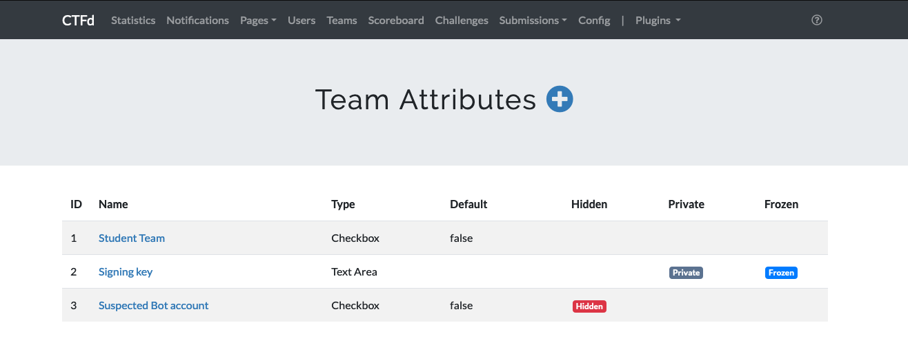

# CTFd Team Attributes

Adds dynamic Attributes to CTFd Teams 

## Admins interface

Admins can pick from different data types for the attributes, including Text, textarea, checkbox, secret (uses password type, but does not encrypt, yet), and Numbers.

Admins can choose a couple view options for each attribute

Hidden attributes are only editable/visiable by admin users.

Private attributes can be viewed/edited by the teams and admins, but cannot be viewed by other teams or public users.

Public attribtues can be viewed by anyone, but can only be edited by the team and admins.

## Teams interface

For Private or public attributes, Teams can edit the addtribute on their team's profile page.

Teams can pick which attribute they want to edit

- notice that the hidden attribute is not shown

Teams can submit data in the datatype of that attribute

